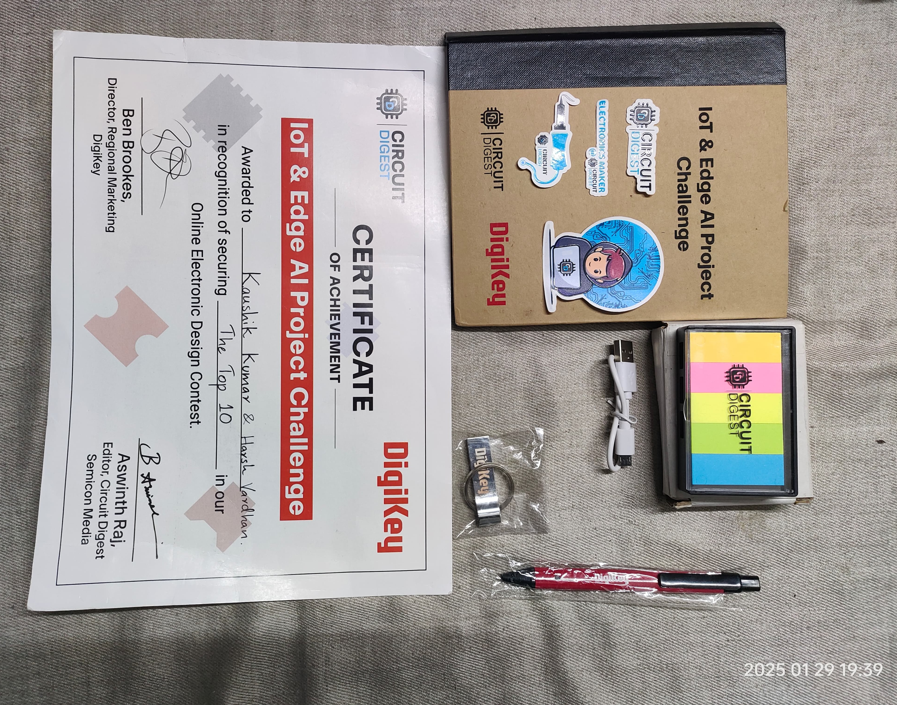

# 🌐 PRAVESH - Smart Entry-Exit System 🌐

_by Kaushik and Harsh_

[](https://opensource.org/licenses/Apache-2.0)
[](https://www.arduino.cc/)
[](https://php.net/)
[](https://www.mysql.com/)


## 📋 Table of Contents

- [Project Overview](#-project-overview)
- [Achievements & Recognition](#-achievements--recognition)
- [Impact Statement](#-impact-statement)
- [Components Used](#-components-used)
- [Circuit Diagram](#-circuit-diagram-explanation)
- [Project Walkthrough](#-project-walkthrough)
- [Arduino Code Overview](#-arduino-code-overview)
- [Working Demonstration](#-working-demonstration)
- [System Working](#-working-of-the-rfid-wi-fi-access-control-system)
- [Frontend Development](#-custom-frontend-development)
- [Installation & Setup](#-installation--setup)
- [Contributing](#-contributing)
- [License](#-license)

---

## 📜 Project Overview

**PRAVESH** is an RFID-enabled Smart Entry-Exit System designed to replace manual entry logs with a seamless digital solution. Using RFID cards, students can access campus facilities with speed and accuracy, reducing delays and promoting accountability. Built on the **Arduino UNO R4 WiFi**, PRAVESH delivers real-time tracking, automated email notifications, and an intuitive interface for campus administration, enhancing security and convenience.

🎬 **Watch Demo Video**: [YouTube](https://youtu.be/IVIbOu4JvdQ)

---

## 🏆 Achievements & Recognition

**PRAVESH** has been recognized in the **IoT & Edge AI Project Challenge 2024** by **Circuit Digest**!

### 🥇 Contest Participation

- **Event**: [IoT & Edge AI Project Challenge 2024](https://circuitdigest.com/contest/iot-edge-ai-project-challenge-2024/) by Circuit Digest
- **Project Submission**: [PRAVESH - Smart Entry-Exit System](https://circuitdigest.com/microcontroller-projects/pravesh-smart-entry-exit-system)
- **Status**: Successfully featured and recognized

### 📜 Certificate & Recognition

<div align="center">
  
  <p><em>Certificate of Recognition from Circuit Digest</em></p>
</div>

### 🎁 Rewards Received

<div align="center">
  
  <p><em>Goodies and rewards received from Circuit Digest</em></p>
</div>

### 🎥 Featured Video

Our project was featured in an official result video by Circuit Digest showcasing the winning and featured projects from the challenge.

**[View Contest Results](https://circuitdigest.com/contest/iot-edge-ai-project-challenge-2024/)**

---

## 🌟 Impact Statement

#### ❖ Streamlined Access

➤PRAVESH revolutionizes entry/exit procedures, replacing manual logs with a fast, error-free RFID-based solution.

#### ❖ Enhanced Accountability

➤With automated logging, students enjoy a hassle-free experience, while the administration gains accurate, paperless records and real-time insights.

#### ❖ Efficient and Modernized

➤Leveraging the Arduino UNO R4 WiFi microcontroller, PRAVESH integrates seamlessly with campus infrastructure, delivering real-time notifications and secure database storage.

#### ❖ Eco-Friendly and Convenient

➤The automated email system for visit approvals reduces paperwork, offering students and staff an efficient and environmentally friendly solution.

---

## 🔧 Components Used

- **Arduino Uno R4 WiFi**
- **RC522 RFID Card Reader Module** (13.56MHz)
- **RFID Cards and Key Tags** (13.56MHz)
- **RGB LED**
- **5V Passive Buzzer**
- **LCD1602 Display** with IIC/I2C interface
- **IIC/I2C Serial Interface Adapter Module**
- **10K Ohm Resistor**
- **Jumper Wires**
- **Bread Board**

---

## 📐 Circuit Diagram Explanation


1. **Power Input**

   - Powered via USB from a laptop or through a 7.4V Li-ion battery pack to the `Vin` and `Ground` on Arduino.

2. **RFID Scanner Module Connections**

   - SDA -> Arduino pin 10
   - SCK -> Arduino pin 13
   - MOSI -> Arduino pin 11
   - MISO -> Arduino pin 12
   - Reset -> Arduino pin 9
   - Power -> 3.3V on Arduino

3. **Buzzer**

   - Shared ground with the RGB LED.
   - Buzzer pin -> Arduino pin 5

4. **RGB LED**

   - Red -> Arduino pin 3
   - Blue -> Arduino pin 2
   - Green -> Arduino pin 1
   - Ground with resistor in between.

5. **LCD Display (I2C Interface)**
   - SDA -> Arduino pin A4
   - SCL -> Arduino pin A5
   - VCC -> 5V output from Arduino
   - Ground -> Common ground with Arduino

---

## 📝 Project Walkthrough

1. **Wi-Fi Connection Status**

   - **Red LED** indicates no Wi-Fi connection; display shows "WiFi Connecting".
   - **Green LED** when connected, prompting "Scan your card".

2. **RFID Tag Scanning**

   - **Display Update**: Shows "Wait" after scan; a sound confirms scan.
   - **UID Sent to Server**: RFID UID is transmitted via HTTP POST to the server, matched with user email, and an automated email is sent for logging.

3. **Feedback and Reset**
   - After a successful scan, display shows "Thank You" and resets to "Scan Your Card".

---

## 🧑‍💻 Arduino Code Overview

➤For Better Explanation let's split the code into three parts: setup, loop, and supporting functions.

### 1. 🛠 Setup and Initialization

➤ This segment initializes the RFID reader, LEDs, buzzer, LCD, and connects to WiFi.
➤It also displays the initial connection status on the LCD.

```cpp
#include <WiFiS3.h>
#include <ArduinoHttpClient.h>
#include <SPI.h>
#include <MFRC522.h>
#include <Wire.h>
#include <LiquidCrystal_I2C.h>

// Define constants
#define RED_LED_PIN 1
#define GREEN_LED_PIN 2
#define BLUE_LED_PIN 3
#define BUZZER_PIN 5 // Define the buzzer pin

String URL = "http://192.168.104.160/rfidattendance/test_data.php";
const char* ssid = "kk"; // Your WiFi network name
const char* password = "12345678"; // Your WiFi password

#define RST_PIN 9
#define SS_PIN 10

MFRC522 rfid(SS_PIN, RST_PIN); // Create MFRC522 instance
WiFiClient wifiClient; // Create WiFiClient instance
HttpClient client = HttpClient(wifiClient, "192.168.104.160", 80); // Use IP and port for the server

// Initialize LCD with I2C address (0x27 is common, but check your LCD's documentation)
LiquidCrystal_I2C lcd(0x27, 16, 2); // 16 columns, 2 rows

void setup() {
Serial.begin(115200);
SPI.begin();
rfid.PCD_Init(); // Initialize MFRC522
Serial.println("RFID Reader initialized.");

// Initialize LED pins
pinMode(RED_LED_PIN, OUTPUT);
pinMode(GREEN_LED_PIN, OUTPUT);
pinMode(BLUE_LED_PIN, OUTPUT);
pinMode(BUZZER_PIN, OUTPUT); // Initialize buzzer pin

// Initialize LEDs and buzzer to off
digitalWrite(RED_LED_PIN, HIGH);
digitalWrite(GREEN_LED_PIN, LOW);
digitalWrite(BLUE_LED_PIN, LOW);
digitalWrite(BUZZER_PIN, LOW);

// Initialize LCD
lcd.init();
lcd.backlight(); // Turn on LCD backlight
lcd.clear();

// Display initial message
lcd.setCursor(0, 0);
lcd.print("WiFi Connecting..");

// Connect to WiFi
WiFi.begin(ssid, password);
while (WiFi.status() != WL_CONNECTED) {
delay(1000);
}

Serial.println("\nConnected to WiFi!");
Serial.print("IP Address: ");
Serial.println(WiFi.localIP());
lcd.clear();
lcd.setCursor(0, 0);
lcd.print("WiFi Connected");
delay(2000); // Wait before starting the loop
}
```

### 2. 📶 WiFi And RFID Status Check

➤This part checks WiFi connectivity and prompts the user to scan their RFID card.
➤The LCD displays appropriate messages, and LEDs indicate WiFi status.

```cpp
void loop() {
        if (WiFi.status() != WL_CONNECTED) {
        // If not connected to Wi-Fi, display "WiFi not connected"
        lcd.clear();
        lcd.setCursor(0, 0);
        lcd.print("WiFi not connected");
        digitalWrite(RED_LED_PIN, HIGH); // Red LED on
        digitalWrite(GREEN_LED_PIN, LOW);
        digitalWrite(BLUE_LED_PIN, LOW);
        return;
        } else {
        // If connected to Wi-Fi, display "Scan your card"
        lcd.clear();
        lcd.setCursor(0, 0);
        lcd.print("Scan your card");
        digitalWrite(RED_LED_PIN, LOW);
        digitalWrite(GREEN_LED_PIN, HIGH); // Green LED on
        digitalWrite(BLUE_LED_PIN, LOW);
        }
```

### 3. 🛜 RFID Scanning and UID Transmission

➤This segment reads the RFID UID, displays a "Wait" message on the LCD, and sends the UID to the server. It handles server response and updates the LCD and LEDs accordingly.

```cpp
// Look for new RFID tags
if (!rfid.PICC_IsNewCardPresent() || !rfid.PICC_ReadCardSerial()) {
return;
}

// Read UID
String uid = "";
for (byte i = 0; i < rfid.uid.size; i++) {
if (rfid.uid.uidByte[i] < 0x10) {
uid += "0"; // Add leading zero if needed
}
uid += String(rfid.uid.uidByte[i], HEX);
}

// Print the UID
Serial.print("UID tag: ");
Serial.println(uid);

// Display "Wait" on LCD and turn on blue LED and buzzer when tag is read
lcd.clear();
lcd.setCursor(0, 0);
lcd.print("Wait");
digitalWrite(BLUE_LED_PIN, HIGH); // Blue LED on
digitalWrite(BUZZER_PIN, HIGH); // Buzzer on

// Send UID to server
String postData = "uid=" + uid;
client.beginRequest();
client.post("/rfidattendance/test_data.php");
client.sendHeader("Content-Type", "application/x-www-form-urlencoded");
client.sendHeader("Content-Length", postData.length());
client.beginBody();
client.print(postData);
client.endRequest();

int statusCode = client.responseStatusCode();
String response = client.responseBody();

Serial.print("Status code: ");
Serial.println(statusCode);
Serial.print("Response: ");
Serial.println(response);
Serial.println("------------------------------------------");

// After sending UID, turn off blue LED, buzzer, and display "Thank you"
digitalWrite(BLUE_LED_PIN, LOW);
digitalWrite(BUZZER_PIN, LOW);
digitalWrite(GREEN_LED_PIN, HIGH); // Green LED back on
lcd.clear();
lcd.setCursor(0, 0);
lcd.print("Thank you");
delay(2000); // Show "Thank you" for 2 seconds

// Display "Scan your card" again
lcd.clear();
lcd.setCursor(0, 0);
lcd.print("Scan your card");

// Halt PICC
rfid.PICC_HaltA();
// Stop encryption on PCD
rfid.PCD_StopCrypto1();

delay(5000); // Short delay to prevent rapid switching
}
```

---

## 📝 Working Demonstration

Below, you can see the working images of the project:

- **Not Connected to Wi-Fi:** LED is red, and the screen shows “WiFi Connecting.”
  

- **Connected to Wi-Fi:** The screen displays "Wi-Fi Connected."
  

- **System Ready:** LED turns green, signifying the system is ready to be used, and the screen displays “Scan your card.”
  

- **RFID Scanning:** When an RFID card is scanned, it sends the UID to the server. The screen shows “Wait,” indicating wait time before scanning the next RFID card. Upon successful scanning, the screen displays "Thank You" as a confirmation.
  

- **System Reset:** After a successful scan, the display shows "Scan Your Card," indicating the system is ready for the next user.
  

## 🛜 Working of the RFID Wi-Fi Access Control System

This project functions as an RFID-based access control system that uses an **Arduino Uno R4 Wi-Fi** to connect to a server, send card UIDs, and provide real-time feedback through LEDs, a display, and a buzzer. The system operates as follows:

### ❖ Setup and Initialization

- Upon powering on, the **Arduino Uno R4 Wi-Fi** connects to the configured Wi-Fi network. If connected successfully, the green LED turns on, and the display shows “Scan your card” to indicate network readiness. The **RFID reader (MFRC522)** and other output components are also initialized.

### ❖ Wi-Fi Status Check

- In each loop iteration, the Arduino Uno R4 Wi-Fi checks its Wi-Fi connection status. If disconnected, the red LED lights up, and the screen shows “WiFi connecting...”. Once Wi-Fi reconnects, the red LED turns off, the green LED turns back on, and the screen displays “WiFi connected.”

### ❖ RFID Tag Detection

- The RFID reader continuously scans for new RFID tags. When a tag is detected, the reader retrieves the **UID**, a unique identifier for each tag. This UID is converted to a string for easy transmission.

### ❖ Visual and Audio Feedback

- Upon detecting an RFID tag, the system activates the LED, buzzer, and updates the screen to “Wait,” indicating a wait time between two RFID scans. This provides immediate feedback to the user that their tag has been scanned.

### ❖ Data Transmission to Server

- The UID is sent to the server using an **HTTP POST request**. The server URL is predefined, and the UID data is posted to the endpoint `/rfidattendancet/test_data.php`. The server response status and body are printed to the Serial Monitor for debugging and confirmation.

### ❖ Completion and Reset

- After the UID is successfully sent, the system changes the display from “Wait” to “Scan your card,” readying the system for the next scan. The RFID reader halts communication with the card to conserve power until the next tag is detected.

### ❖ Email Functionality

- During data transmission to the server, the UID is matched to the registered email of the respective user. A form is sent to the user’s email, asking for the **reason for visit** and an **estimated return time**. Once the user submits the form, it automatically updates the database.
- The form sent to email is as follows:
  

### ❖ Delay and Repeat

- A short delay prevents the system from reading the same card multiple times too quickly. The system then loops back to check for Wi-Fi status and new RFID tags, maintaining continuous operation.

## 💻 Custom Frontend Development

We have crafted a sleek and intuitive frontend using **HTML** and **CSS**, ensuring a visually appealing website that not only meets the aesthetic needs but also serves the functional requirements for managing the system. The frontend is designed to provide ease of access and streamline the administration process.

To store and manage data, we integrated a **MySQL database** that holds user and log information securely. The backend communication with the MySQL database is handled efficiently using **PHP**, ensuring smooth handling of POST requests from the **Arduino UNO R4 Wi-Fi** board and seamless data retrieval.

The frontend consists of the following key pages:

### 1. Login Page

This page serves as the authentication gateway, ensuring that only authorized personnel can access sensitive data. Users can log in using their **admin email ID** and **password**, providing a secure and controlled access point to the system.


### 2. Users Page

This page displays a list of all users currently registered in the system. The user details shown include:

- **User ID**
- **UID**
- **Name**
- **Email ID**

The Users Page allows administrators to quickly view the status of all registered users.


### 3. Manage Users Page

This page enables administrators to perform key user management tasks:

- **Adding New Users**: Easily register new users with necessary details.
- **Updating Existing User Details**: Modify user information, including:
  - **ID**
  - **Name**
  - **Gender**
  - **S. No.**
  - **Email ID**
- **Removing Users**: Administrators can remove users from the system as needed.
  

### 4. Users Log Page

This page presents a comprehensive log of student entry and exit details. The information displayed includes:

- **User ID**
- **Card UID**
- **Name**
- **Gender**
- **Date and Time of Entry/Exit**
- **Reason for Visit**
- **Estimated Time of Return**

The Users Log Page offers administrators an easy-to-navigate interface to monitor all student movements in real-time.


### 5. Export to Excel Page

The Export to Excel page provides the ability to download **Users Log Page** data in an **Excel (.xlsx)** format. Administrators can filter logs based on **date and time**, allowing for custom export of specific periods for further analysis or record-keeping.


---

With this frontend setup, we have ensured a well-structured, user-friendly, and secure interface for managing and accessing data, making the administration process smoother and more efficient.

## ⚙️ Installation & Setup

### Prerequisites

- Arduino IDE (latest version)
- Web server with PHP support (XAMPP/WAMP recommended)
- MySQL database
- Arduino Uno R4 WiFi
- Required hardware components (see [Components Used](#-components-used))

### Hardware Setup

1. Connect components according to the [Circuit Diagram](#-circuit-diagram-explanation)
2. Upload the Arduino code from `Arduino Code/Pravesh.ino`
3. Configure WiFi credentials in the Arduino code

### Software Setup

1. **Database Setup**:

   ```sql
   # Import the database schema
   mysql -u username -p database_name < Database/sensor_db.sql
   ```

2. **Web Server Setup**:

   - Place the `api/` folder in your web server directory
   - Configure database connection in `api/connectDB.php`
   - Update the server URL in Arduino code

3. **Configuration**:
   - Update WiFi credentials in Arduino code
   - Configure email settings in `api/` PHP files
   - Set appropriate permissions for web directories

## 🚀 Usage

1. Power on the Arduino device
2. Wait for WiFi connection (green LED indicator)
3. Access the web interface through your browser
4. Scan RFID cards to log entries/exits
5. Monitor logs through the web dashboard

## 📁 Project Structure

```
PRAVESH-Smart_Entry-Exit_System/
├── Achievement/              # Contest achievements and certificates
├── api/                     # Backend PHP files and database
├── Arduino Code/            # Arduino source code
├── Database/               # MySQL database schema
├── Form/                   # Email form templates
├── Frontend Website Images/ # UI screenshots
└── README.md               # Project documentation
```

## 🤝 Contributing

We welcome contributions to improve PRAVESH! Here's how you can help:

1. **Fork** the repository
2. **Create** a feature branch (`git checkout -b feature/AmazingFeature`)
3. **Commit** your changes (`git commit -m 'Add some AmazingFeature'`)
4. **Push** to the branch (`git push origin feature/AmazingFeature`)
5. **Open** a Pull Request

### Development Guidelines

- Follow existing code style and conventions
- Test all changes thoroughly before submitting
- Update documentation for any new features
- Ensure hardware connections are properly documented

## 📝 License

This project is licensed under the Apache License 2.0 - see the [LICENSE](LICENSE) file for details.

## 👥 Authors

- **Kaushik** - Hardware Design & Arduino Programming
- **Harsh Vardhan** - Full-Stack Development & System Integration

## 🙏 Acknowledgments

- **Circuit Digest** for featuring our project in the IoT & Edge AI Challenge 2024
- Arduino community for excellent documentation and support
- All contributors and supporters of the PRAVESH project

## 📞 Contact

For questions, suggestions, or collaboration opportunities, feel free to reach out:

- 📧 Email: Contact information available in the Achievement section
- 🔗 Project Link: [https://github.com/The-Harsh-Vardhan/PRAVESH-Smart_Entry-Exit_System](https://github.com/The-Harsh-Vardhan/PRAVESH-Smart_Entry-Exit_System)

---

<div align="center">
  <p><strong>⭐ If you found this project helpful, please give it a star! ⭐</strong></p>
  <p>Made with ❤️ by Kaushik and Harsh Vardhan</p>
</div>
